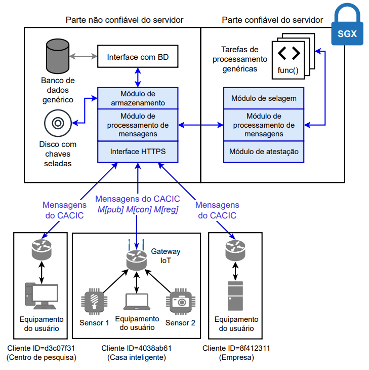

About CACIC
=================

CACIC is an architecture that allows clients to customize access permissions for its 
IoT data in clouds. By leveraging isolated memory enclaves, CACIC can achieve security 
even if the operating system or cloud administrator try to act maliciously. In CACIC, 
each client has its public ``ID`` and 128-bit secret key (``CK``), shared with an 
enclave after attesting its security. 

Publication messages
----------------------

Publication messages have the following format:

``M[publication]=[time|ID|type|size|CK(ID|pub_req|perm|nonce)]``

They contain a publication request (``req``) and a list of identifications (IDs) from 
users who can access the published data (``perm``). Both the message and the list are 
encrypted with the CK. Depending on the publication request type (``type``), the server 
core either publishes a new sample or performs a processing task before publishing the 
result. The result is stored encrypted along with the list of access permissions. Even 
though the server core may query additional data from the database, the access is only 
granted if the stored permissions include the requesting client. 

Query messages
----------------------

Query messages have the following format:

``M[query]=[ID|size|que_req|CK(ID|nonce)]``

The ``que_req`` identifies the data for being queried from the database. The server 
decrypts the stored data and forwards it to the client only if the access permission 
list, stored with the data, includes the querier ``ID``.
