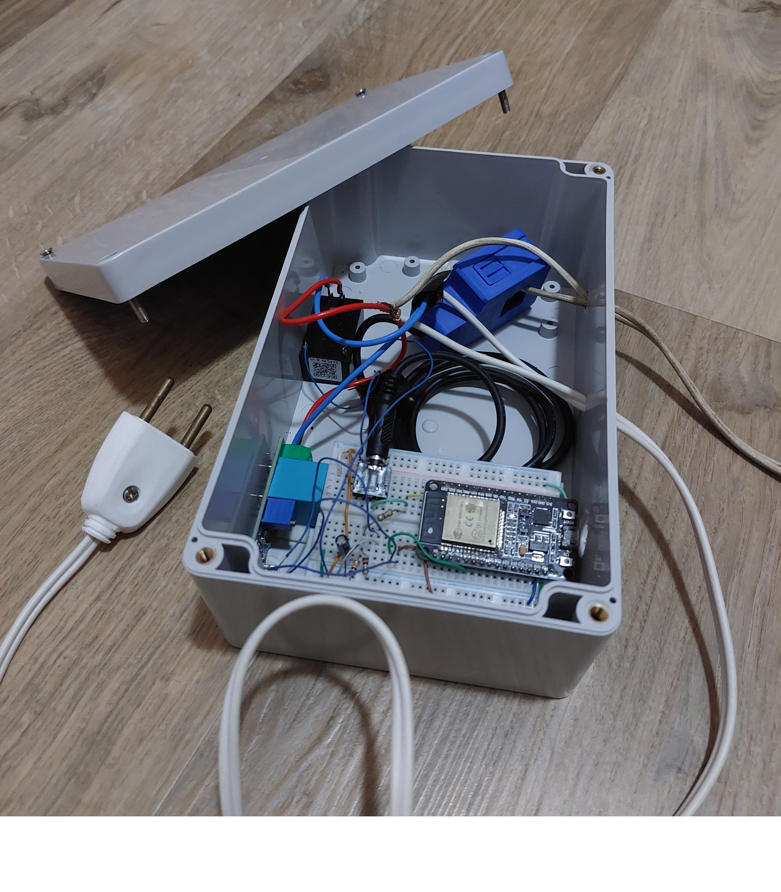

Demonstration
===================================

The following four components are necessary to run our demo:

* A Smart Meter (SM) that periodicaly sends measurements HTTP consumption data 
* (in kwh) as follows::

http://[access_point_url]:5555/smart-meter=[payload]

Components
=======================
* A Linux Access Point (AP) running the process ``./Client ap_init``
* A Linux User Equipment (UE) running the GUI (or CLI) Management Application, 
  built with the steps above
* A Linux Server running the server process, built with the previous steps

Video Link: `https://youtu.be/CFEsD-25Mp0 <https://youtu.be/CFEsD-25Mp0>`_

