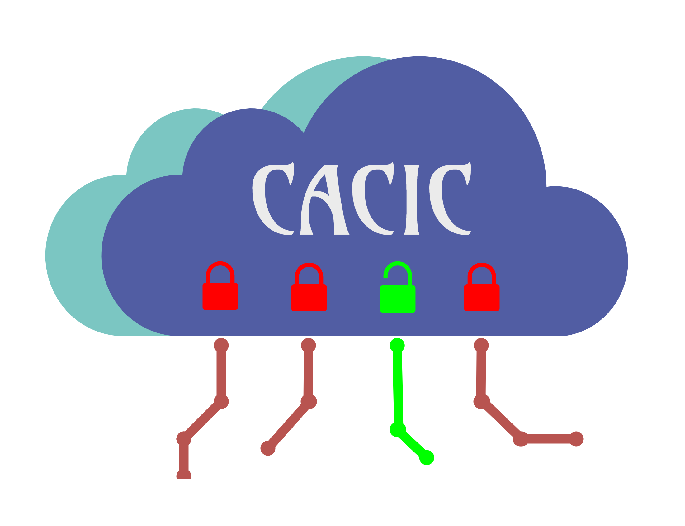

CACIC-DevKit
=====

CACIC-DevKit provides a way for developers to create IoT systems with a highly-secure 
access permissions management for cloud computing. The developer can choose the data 
source, access point, management application, processing tasks and database that better 
suit its need.
 
.. toctree::
   :maxdepth: 1

   started
   developing
   demo
